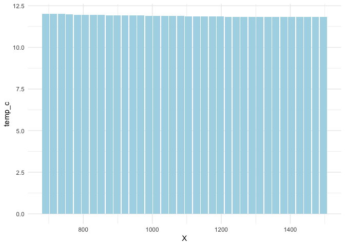
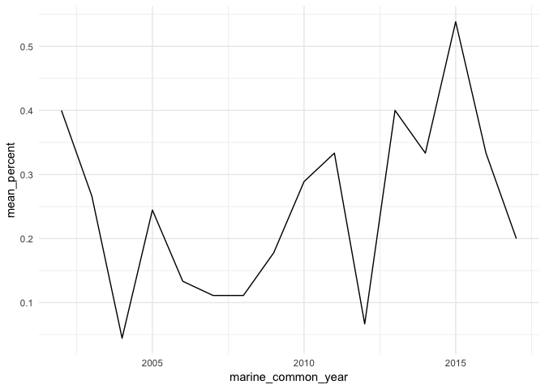

Location
================

This document extracts location and date information from PISCO, species and sea star wasting syndrome datasets and tries to merge them.

``` r
# Load some packages and import some data frames
library(ggplot2)
library(dplyr)
```

    ## 
    ## Attaching package: 'dplyr'

    ## The following objects are masked from 'package:stats':
    ## 
    ##     filter, lag

    ## The following objects are masked from 'package:base':
    ## 
    ##     intersect, setdiff, setequal, union

Photo plots
-----------

> PermanentPhoto plot methods photo photoplots are used to monitor percent cover of organisms within target species assemblages. Plots are established for a given species assemblage if overall cover at a site is sufficient for monitoring. In general, 5 replicate plots (50 x 75 cm) are placed in a stratified random manner throughout the target species' zone of maximum abundance.
> Plots are photographed in the field, and are scored for percent cover using a grid of 100 points, either in the field or in the lab from photos. A species, higher taxon, or substrate located below each of the 100 points is identified and recorded. Layering is not generally scored separately, so the total cover is 100 percent. However, there is an optional method for sampling photo plots that includes layering and spatial position. With this optional method, the top and bottom layers are recorded for each location on the grid. This provides extra data that can be used to gather information on species associations and small scale spatial changes over time.

So first we get the [photo plots data](https://www.eeb.ucsc.edu/pacificrockyintertidal/explore-the-data/index.html). We can see the data is inside four states.

``` r
sea_stars <- read.csv("../data/downloaded/phototranraw_download.csv", stringsAsFactors = FALSE)
unique(sea_stars$state_province)
```

    ## [1] "Alaska"     "Washington" "Oregon"     "California"

We first examine the species data inside California and later to all the data.

``` r
sea_stars_ca <- sea_stars[sea_stars$state_province == 'California', ]
# add ids to represent each row
sea_stars_ca <- mutate(sea_stars_ca, id = 1:nrow(sea_stars_ca))
head(sea_stars_ca, 10)
```

    ##    group_code site_code marine_site_name marine_sort_order latitude
    ## 1        UCSC       END          Enderts              5010    41.69
    ## 2        UCSC       END          Enderts              5010    41.69
    ## 3        UCSC       END          Enderts              5010    41.69
    ## 4        UCSC       END          Enderts              5010    41.69
    ## 5        UCSC       END          Enderts              5010    41.69
    ## 6        UCSC       END          Enderts              5010    41.69
    ## 7        UCSC       END          Enderts              5010    41.69
    ## 8        UCSC       END          Enderts              5010    41.69
    ## 9        UCSC       END          Enderts              5010    41.69
    ## 10       UCSC       END          Enderts              5010    41.69
    ##    longitude survey_date marine_common_season marine_season_code
    ## 1  -124.1426  2004-06-04                   93               SP04
    ## 2  -124.1426  2004-06-04                   93               SP04
    ## 3  -124.1426  2004-06-04                   93               SP04
    ## 4  -124.1426  2004-06-04                   93               SP04
    ## 5  -124.1426  2004-06-04                   93               SP04
    ## 6  -124.1426  2004-06-04                   93               SP04
    ## 7  -124.1426  2004-06-04                   93               SP04
    ## 8  -124.1426  2004-06-04                   93               SP04
    ## 9  -124.1426  2004-06-04                   93               SP04
    ## 10 -124.1426  2004-06-04                   93               SP04
    ##    marine_common_year season_sequence season_name  target_assemblage
    ## 1                2004               1      Spring chthamalus_balanus
    ## 2                2004               1      Spring chthamalus_balanus
    ## 3                2004               1      Spring chthamalus_balanus
    ## 4                2004               1      Spring chthamalus_balanus
    ## 5                2004               1      Spring chthamalus_balanus
    ## 6                2004               1      Spring chthamalus_balanus
    ## 7                2004               1      Spring chthamalus_balanus
    ## 8                2004               1      Spring chthamalus_balanus
    ## 9                2004               1      Spring chthamalus_balanus
    ## 10               2004               1      Spring chthamalus_balanus
    ##    plot_code lumping_code percent_cover mpa_designation  mpa_region
    ## 1          1       ANTELE             0            NULL North Coast
    ## 2          1       ARTCOR             0            NULL North Coast
    ## 3          1       CHITON             0            NULL North Coast
    ## 4          1       CHOCAN             0            NULL North Coast
    ## 5          1       CHTBAL            58            NULL North Coast
    ## 6          1       CLACOL             0            NULL North Coast
    ## 7          1       CRUCOR             0            NULL North Coast
    ## 8          1       EGRMEN             0            NULL North Coast
    ## 9          1       EISARB             0            NULL North Coast
    ## 10         1       ENDMUR             0            NULL North Coast
    ##    georegion                         bioregion state_province   island
    ## 1   CA North WA Olympic Coast to San Francisco     California Mainland
    ## 2   CA North WA Olympic Coast to San Francisco     California Mainland
    ## 3   CA North WA Olympic Coast to San Francisco     California Mainland
    ## 4   CA North WA Olympic Coast to San Francisco     California Mainland
    ## 5   CA North WA Olympic Coast to San Francisco     California Mainland
    ## 6   CA North WA Olympic Coast to San Francisco     California Mainland
    ## 7   CA North WA Olympic Coast to San Francisco     California Mainland
    ## 8   CA North WA Olympic Coast to San Francisco     California Mainland
    ## 9   CA North WA Olympic Coast to San Francisco     California Mainland
    ## 10  CA North WA Olympic Coast to San Francisco     California Mainland
    ##    last_updated id
    ## 1    2018-08-23  1
    ## 2    2018-08-23  2
    ## 3    2018-08-23  3
    ## 4    2018-08-23  4
    ## 5    2018-08-23  5
    ## 6    2018-08-23  6
    ## 7    2018-08-23  7
    ## 8    2018-08-23  8
    ## 9    2018-08-23  9
    ## 10   2018-08-23 10

We can see plenty of repeating latitudes and longitudes so we can extract the unique pairs of latitude and longitude, ie, unique locations and a survey date with an average percent\_cover of that day.

``` r
ca_unique_ld <- sea_stars_ca %>% 
  group_by(longitude, latitude, survey_date, target_assemblage) %>%
  summarise(mean_percent = mean(percent_cover))

head(ca_unique_ld, 10)
```

    ## # A tibble: 10 x 5
    ## # Groups:   longitude, latitude, survey_date [2]
    ##    longitude latitude survey_date target_assemblage  mean_percent
    ##        <dbl>    <dbl> <chr>       <chr>                     <dbl>
    ##  1     -124.     40.3 2004-06-03  chthamalus_balanus         2.33
    ##  2     -124.     40.3 2004-06-03  endocladia                 2.22
    ##  3     -124.     40.3 2004-06-03  fucus                      2.22
    ##  4     -124.     40.3 2004-06-03  mastocarpus                2.22
    ##  5     -124.     40.3 2004-06-03  mytilus                    2.22
    ##  6     -124.     40.3 2004-06-03  pelvetiopsis               2.22
    ##  7     -124.     40.3 2005-06-22  chthamalus_balanus         2.27
    ##  8     -124.     40.3 2005-06-22  endocladia                 2.21
    ##  9     -124.     40.3 2005-06-22  fucus                      2.22
    ## 10     -124.     40.3 2005-06-22  mastocarpus                2.22

PISCO
-----

Some setup for getting the location data.

``` r
library(dataone)
library(XML)

id <- dataset_w_pop[1, 3]
cn <- CNode("PROD")

# get the node of this metadata using `dataOne` package
locations <- resolve(cn, id)
mnId <- locations$data[1, "nodeIdentifier"]
mn <- getMNode(cn, mnId)
```

Define a function which returns location and date information of the ith PISCO datasets.

``` r
getLocationNDate <- function(i) {
  # id of the ith row of the PISCO datasets
  id <- dataset_w_pop[i, 3]

  # download the metadata file to find the data table
  metadata <- rawToChar(getObject(mn, id))
  doc = xmlRoot(xmlTreeParse(metadata, asText=TRUE, trim = TRUE, ignoreBlanks = TRUE))

  # now extract the node that has the data table's location information
  node <- getNodeSet(doc, "//boundingCoordinates")
  curLoc <- head(xmlToDataFrame(node, stringsAsFactors = FALSE), 1)
  west <- as.numeric(curLoc[1, 1])
  east <- as.numeric(curLoc[1, 2])
  north <- as.numeric(curLoc[1, 3])
  south <- as.numeric(curLoc[1, 4])
  
  begin_node <- getNodeSet(doc, "//beginDate")
  begin_date <- xmlToDataFrame(begin_node, stringsAsFactors = FALSE)[1, 1]
  end_node <- getNodeSet(doc, "//endDate")
  end_date <- xmlToDataFrame(end_node, stringsAsFactors = FALSE)[1, 1]
  
  # take the average of west and east, and north and south
  thisLoc <- data.frame(longitude = c((1/2)*(west + east)), latitude = c((1/2)*(north + south)), begin = c(begin_date), end = c(end_date), ID = c(id))
  
  return(thisLoc)
}
```

``` r
getLocationNDate(926)
```

> Error in .local(x, ...) : get() error: READ not allowed on <doi:10.6085/AA/JALXXX_015ADCP015R00_20030529.50.2>

After testing, 926th ID doesn't work

``` r
allLocationNDate <- data.frame()
for (i in 1:925) {
  allLocationNDate <- rbind(allLocationNDate, getLocationNDate(i))
}

for (i in 927:nrow(dataset_w_pop)) {
  allLocationNDate <- rbind(allLocationNDate, getLocationNDate(i))
}
```

We save this data frame into a `.csv` file.

``` r
write.csv(allLocationNDate, '../data/pisco-locations-dates.csv')
```

Find the nearest PISCO site for each species data entry
-------------------------------------------------------

Define a function that takes in index `i`, sea stars data `sea_star_dt` and PISCO data `pisco_dt` and returns the row number of the neareast PISCO data

``` r
head(allLocationNDate, 10)
```

    ##     X longitude latitude      begin        end
    ## 1   1 -122.1579 36.97290 2001-03-12 2001-05-14
    ## 2   2 -121.9448 36.55800 2005-01-06 2005-04-05
    ## 3   3 -120.6358 34.86919 2002-04-23 2002-06-12
    ## 4   4 -119.6960 34.03130 2004-10-11 2004-12-20
    ## 5   5 -122.0804 36.94342 2002-01-24 2002-04-16
    ## 6   6 -124.1273 44.25160 2002-05-15 2002-06-26
    ## 7   7 -122.1579 36.97290 2002-01-15 2002-04-11
    ## 8   8 -124.0255 45.00190 2001-04-20 2001-07-09
    ## 9   9 -120.6358 34.86919 2005-02-26 2005-05-24
    ## 10 10 -122.1585 36.97212 2003-04-29 2003-07-27
    ##                                                   ID
    ## 1  doi:10.6085/AA/SHB001_021ADCP020R00_20010312.50.1
    ## 2  doi:10.6085/AA/SWC001_022ADCP021R00_20050106.50.3
    ## 3  doi:10.6085/AA/PTSXXX_015ADCP015R00_20020423.50.4
    ## 4  doi:10.6085/AA/PELXXX_015ADCP015R00_20041011.50.8
    ## 5  doi:10.6085/AA/TPT001_018ADCP018R00_20020124.50.4
    ## 6  doi:10.6085/AA/SH15CX_015ADCP014R00_20020515.50.3
    ## 7  doi:10.6085/AA/SHB001_021ADCP020R00_20020115.50.1
    ## 8  doi:10.6085/AA/CH15CX_015ADCP014R00_20010420.50.3
    ## 9  doi:10.6085/AA/PTSXXX_015ADCP015R00_20050226.50.3
    ## 10 doi:10.6085/AA/SHB001_021ADCP020R00_20030429.50.2

Since there are begin and end dates in PISCO datasets, we want to transform the dates into numbers so that we can compare the dates and determine if a data entry in the sea star dataset can find a corresponding dataset in PISCO ones. Now we define a function to do so, using method found on [stackoverflow](https://stackoverflow.com/a/8215581/10733819)

``` r
dateToNum <- function(date) {
  rt <- 0
  date <- as.POSIXlt(date, format = "%Y-%m-%d")
  # yearday will always be less than or equal to 366 so we can represent yeardays as decimal numbers, and years as whole numbers
  rt <- 1900 + date$year + date$yday / 366
  return(rt)
}
```

Two examples of this function:

``` r
dateToNum('0000-02-29')
```

    ## [1] 0.1612022

``` r
dateToNum('2008-02-29')
```

    ## [1] 2008.161

We put in a data frame of species with unique pairs of locations(latitude and longitude) and dates and find their corresponding pisco datasets, using the Euclidean distance and date. If the minimum Euclidean distance is bigger than 1 or the dates do not match, I assume this photo plot data entry doesn't have a corresponding PISCO dataset.

``` r
nearPisWDate <- function(i, sea_star_dt, pisco_dt) {
  ss <- sea_star_dt[i, ]
  ss_loc <- c(ss$longitude, ss$latitude)
  # change the date into a number
  ss_date_n <- dateToNum(ss$survey_date)
  
  min_dis <- 100000
  which_pis <- -1
  for (j in 1:nrow(pisco_dt)) {
    cur_pisco <- pisco_dt[j, ]
    cur_pisco_date <- c(cur_pisco$begin, cur_pisco$end)
    cur_pisco_begin <- dateToNum(cur_pisco_date[1])
    cur_pisco_end <- dateToNum(cur_pisco_date[2])
    if (ss_date_n > cur_pisco_end | ss_date_n < cur_pisco_begin) {
      next
    }
    
    cur_pisco_loc <- c(cur_pisco$longitude, cur_pisco$latitude)
    dis <- (ss_loc[1] - cur_pisco_loc[1])**2 + (ss_loc[2] - cur_pisco_loc[2])**2
    if (dis < min_dis) {
      min_dis <- dis
      which_pis <- j
    }
  }
  if (min_dis > 2) {
    return(-1)
  }
  #result <- list("PISCO" = which_pis, "distance" = min_dis)
  return(which_pis)
}
```

Find corresponding PISCO datasets and save them in a csv. file.

``` r
ca_which_pis <- c()
for (m in 1:nrow(ca_unique_ld)) {
  ca_which_pis <- c(ca_which_pis, nearPisWDate(m, ca_unique_ld, allLocationNDate))
}
write.csv(ca_which_pis, '../data/ca_sea_star_vs_pisco.csv')
```

Next we define a function to combine species datasets and their corrsponding PISCO datasets.

``` r
find_the_pisco <- function(df, data_list) {
  rt <- data.frame()
  for (i in 1:length(data_list)) {
    cur = data_list[i]
    if (cur == -1) {
      next
    }
    cur <- data.frame(latitude = df$latitude[cur], longitude = df$longitude[cur], begin = df$begin[cur], end = df$end[cur], ID = df$ID[cur], species_ind = c(i), pis_ind = c(cur))
    rt <- rbind(rt, cur)
  }
  return(rt)
}
```

``` r
species_pis <- find_the_pisco(allLocationNDate, ca_which_pis$x)
```

My goal is for each data entry of `species_pis`, extract the temprature information from its corresponding PISCO dataset.

Here take one dataset for example:

``` r
# Use a data frame downloaded before
dt1 <- read.csv(file = "~/Documents/nahis/data/d11.csv")
dt1_tem <- filter(dt1, date == '2001-03-12', temp_c != 9999.00)

ggplot(data = dt1_tem, aes(x=X, y=temp_c)) +
  geom_bar(stat="identity", fill = "lightblue") +
  theme_minimal()
```



As we see from the plot above, the ocean temperature doesn't tend to vary a lot within a day, for which one of the reasons is that water has a high "specific heat capacity".

But let's take a look at the ocean temperature data for a longer period of time at one place.
First group the data frame by lumping\_code, marine\_common\_year and target\_assemblage:

``` r
ca_merge <- sea_stars_ca %>% 
  group_by(lumping_code, marine_common_year, target_assemblage) %>%
  summarise(mean_percent = mean(percent_cover))
```

Plot the mean percent cover for balanus by year, at ANTELE.

``` r
ca_merge %>%
  filter(lumping_code == 'ANTELE', target_assemblage =='balanus') %>%
  ggplot(aes(marine_common_year, mean_percent)) + 
  geom_line() +
  theme_minimal()
```



Taking the mean of percent\_cover over one survey day doesn't quite make sense, because percent cover is not an absolute value. Hence I would prefer to see a long-term trend of ocean temperature and its relation to species count data.

Sea Star Wasting Syndrome
=========================

I got the [sea star wasting syndrome](https://www.eeb.ucsc.edu/pacificrockyintertidal/explore-the-data/index.html) data from one of the staff via email.

``` r
ssws <- read.csv("../data/downloaded/sswd_sea_star_observations_2019_0411.csv", stringsAsFactors = FALSE)
```

However, the wasting syndrome data has a different time range than the PISCO data:

``` r
pisco_mean_date <- c()
for (n in 1:length(allLocationNDate$begin)) {
  pisco_mean_date <- c(pisco_mean_date, (dateToNum(allLocationNDate$end[n]) + dateToNum(allLocationNDate$begin[n]))/2)
}
max(pisco_mean_date)
```

    ## [1] 2011.975

``` r
min(pisco_mean_date)
```

    ## [1] 11.38661

``` r
ssws_date <- c()
for (n in 1:length(ssws$sample_date)) {
  ssws_date <- c(ssws_date, dateToNum(ssws$sample_date[n]))
}
max(ssws_date)
```

    ## [1] 2019.205

``` r
min(ssws_date)
```

    ## [1] 2013.178

Hence I may need to save this dataset for later.
