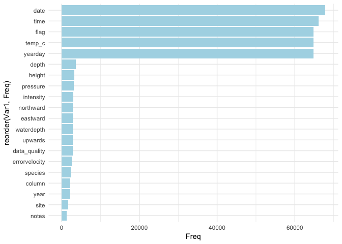
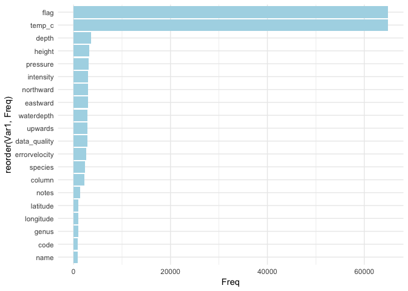

KNB 3
================
Yuqing Lu
11/7/2018

Ciera suggested that looking for the most popular headers of all the datasets should be fun. I thought that would be interesting but had no idea where to start. So I went to the KNB website and joined their Slack channel. One of the staff, Matt Jones, helped get all the attributes of 69957 datasets, extracted from their metadata files using their API.

``` r
# load the package
library(dataone)

# set to the KNB database
cn <- CNode("PROD")
mn <- getMNode(cn, "urn:node:KNB")

# this gives a data frame of the first 1000 metadata files 
# with only their ID and attribute information
all <-
  list(
    q = "formatType:METADATA+AND+attributeName:*",
    fl = "identifier,formatId,attributeName,attributeDescription",
    wt = "xml",
    rows = "1000",
    start = "0"
  )
allre <- query(mn, solrQuery = all, as = "data.frame")
```

Then I used a for loop to merged the 70 data frames and the resulting data frame is `allre`, saved as a csv file. This takes really long.

``` r
# load the package
library(dataone)

# set to the KNB database
cn <- CNode("PROD")
mn <- getMNode(cn, "urn:node:KNB")

allre <- data.frame()
for (i in seq(0, 69000, 1000)) {
  all <-
  list(
    q = "formatType:METADATA+AND+attributeName:*",
    fl = "identifier,formatId,attributeName,attributeDescription",
    wt = "xml",
    rows = "1000",
    start = paste0(i)
  )
  allre <- rbind(allre, query(mn, solrQuery = all, as = "data.frame"))
}
write.csv(allre, file = "~/Documents/nahis/data/knb-attrs.csv")
```

Next I extract all the attribute names, in lower case, in the data frame and put them into one vector, `attrs`.

Of course, some attributes may have different names even though they mean the same thing as other attributes. For example, some datasets may have an attribute names "len", which is the same as "length"; or some may have abbreviations. And this may be harmful to this exploration. So we may want to change the similar attribute

``` r
# this function gives all the attribute names for one metafile, ie, one row of allre
get_attr <- function(x) {
  tolower(unlist(strsplit(allre$attributeName[x], "\\s+")))
}
attrs <- sapply(1:69957, get_attr, simplify=TRUE)
```

Now I make a frequency table of all the attribute names and make a barchart of them in descending order of frequency. Thus we can see which attributes are the most popular.

``` r
attr_tab <- table(factor(unlist(attrs)))
most_pop <- sort(attr_tab, decreasing=TRUE)
write.csv(most_pop, file = "~/Documents/nahis/data/knb-pop-attrs.csv")
head(most_pop, 100)
```

``` r
most_pop <- read.csv("../data/knb-pop-attrs.csv", stringsAsFactors = FALSE)
pop_20 <- head(most_pop, 20)
library(ggplot2)
library(dplyr)
```

    ## 
    ## Attaching package: 'dplyr'

    ## The following objects are masked from 'package:stats':
    ## 
    ##     filter, lag

    ## The following objects are masked from 'package:base':
    ## 
    ##     intersect, setdiff, setequal, union

``` r
ggplot(data = pop_20, aes(x=reorder(Var1, Freq), y=Freq)) +
  geom_bar(stat="identity", fill = "lightblue") +
  theme_minimal() +
  coord_flip()
```



So we see that the first five attributes don't have any special meanings. They just represend time/date. So let's get rid of all the "boring" attributes.

``` r
library(stringr)
attr_not_boring <- 
  filter(most_pop, !str_detect(
                    Var1, "(year|date|time|day|site|month|location|station)"))
```

``` r
pop6to20 <- slice(attr_not_boring, 1:20)
ggplot(data = pop6to20, aes(x=reorder(Var1, Freq), y=Freq)) +
  geom_bar(stat="identity", fill = "lightblue") +
  theme_minimal() +
  coord_flip()
```



Let's extract the metafiles with common popular attributes. Now it seems that the datasets that have the first 12 "not boring popular" attributes in common come from the same cluster of datasets, since they have exactly the same attributes and attribute descriptions.

``` r
all_files <- read.csv("../data/knb-attrs.csv", stringsAsFactors = FALSE)
pop_vars <- slice(attr_not_boring, 1:12)$Var1
dataset_w_pop <- filter(all_files, grepl(pop_vars[1], all_files$attributeName))
for (i in 2:length(pop_vars)) {
    dataset_w_pop <- filter(dataset_w_pop, grepl(pop_vars[i], dataset_w_pop$attributeName))
}
id <- dataset_w_pop[1, 2]
```

``` r
library(XML)
metadata <- rawToChar(getObject(mn, id))
doc = xmlRoot(xmlTreeParse(metadata, asText=TRUE, trim = TRUE, ignoreBlanks = TRUE))

doc
dataRaw <- getObject(mn, "knb/SHB001_021ADCP020R00_20010312.40.1")
dataChar <- rawToChar(dataRaw)
theData <- textConnection(dataChar)
df <- read.csv(theData, stringsAsFactors=FALSE)
write.csv(df, file = "~/Documents/knb-susquehanna-river-flow.csv")
```

Now we are back to xml...
<https://www.stat.berkeley.edu/~statcur/Workshop2/Presentations/XML.pdf>
