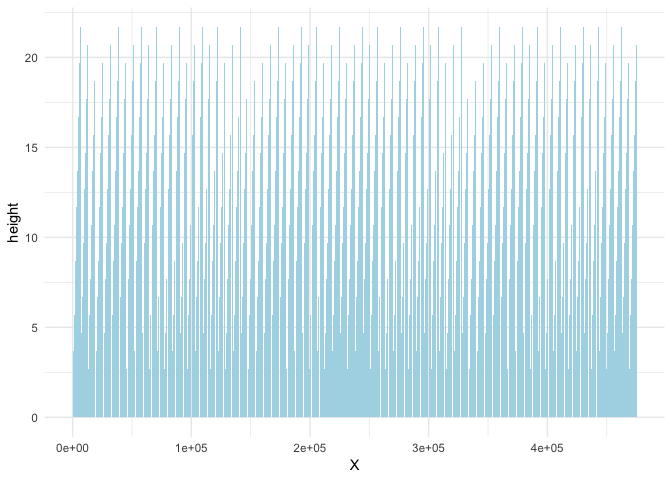
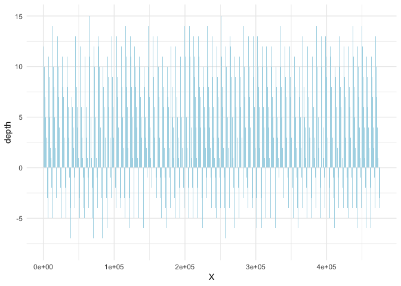
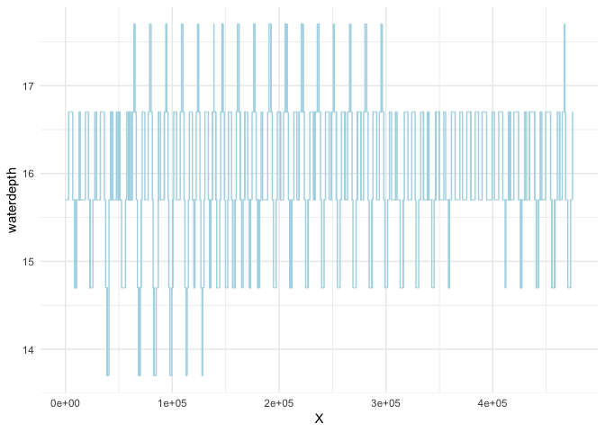
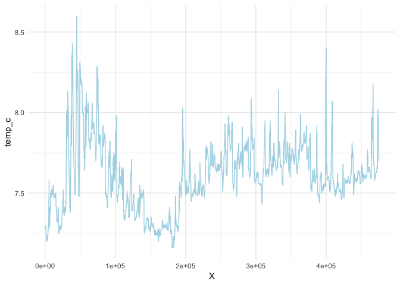
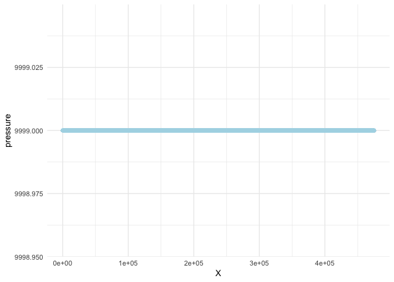
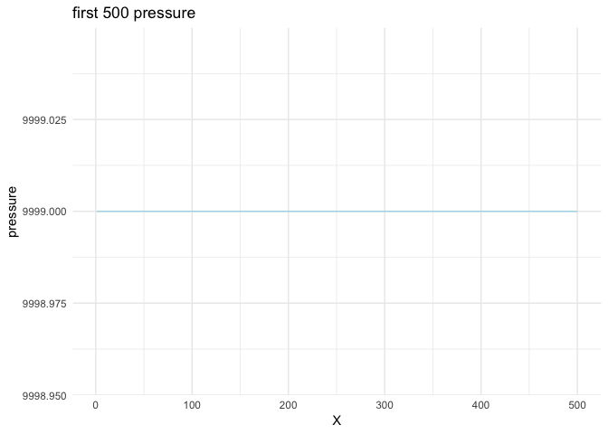
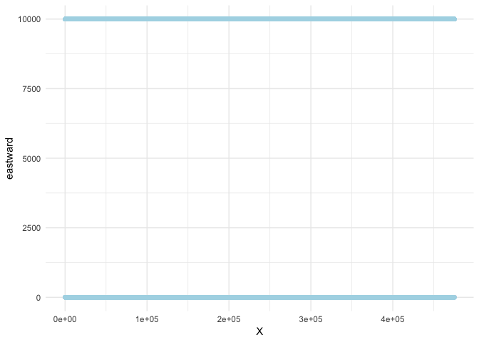
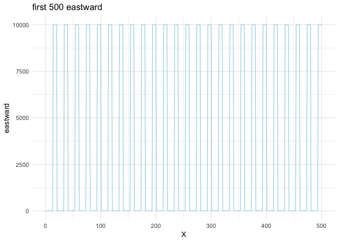
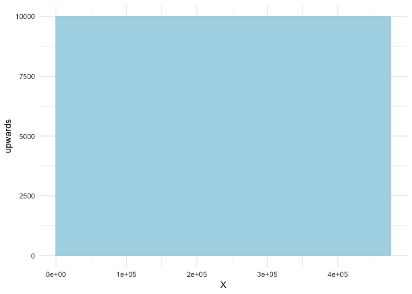
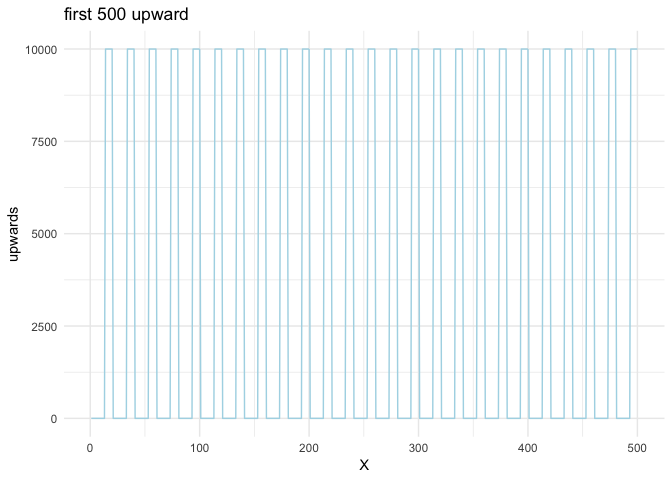

Understanding and Processing KNB PISCO data
================

``` r
knitr::opts_chunk$set(echo = TRUE, fig.path = 'knb-process_files/figure-markdown_github/')
# Load some packages and import some data frames
library(ggplot2)
library(dplyr)
```

    ## 
    ## Attaching package: 'dplyr'

    ## The following objects are masked from 'package:stats':
    ## 
    ##     filter, lag

    ## The following objects are masked from 'package:base':
    ## 
    ##     intersect, setdiff, setequal, union

``` r
d203 <- read.csv("../data/d203.csv", stringsAsFactors = FALSE)
dataset_w_pop <- read.csv("../data/pop_ds.csv", stringsAsFactors = FALSE)
```

Let's look at one dataset, understand its attributes and do some processing.

``` r
head(d203, 10)
```

    ##     X       date         time  yearday height depth waterdepth temp_c
    ## 1   1 2002-08-02 19:02:03.00Z 213.7931    2.7    13       15.7   7.29
    ## 2   2 2002-08-02 19:02:03.00Z 213.7931    3.7    12       15.7   7.29
    ## 3   3 2002-08-02 19:02:03.00Z 213.7931    4.7    11       15.7   7.29
    ## 4   4 2002-08-02 19:02:03.00Z 213.7931    5.7    10       15.7   7.29
    ## 5   5 2002-08-02 19:02:03.00Z 213.7931    6.7     9       15.7   7.29
    ## 6   6 2002-08-02 19:02:03.00Z 213.7931    7.7     8       15.7   7.29
    ## 7   7 2002-08-02 19:02:03.00Z 213.7931    8.7     7       15.7   7.29
    ## 8   8 2002-08-02 19:02:03.00Z 213.7931    9.7     6       15.7   7.29
    ## 9   9 2002-08-02 19:02:03.00Z 213.7931   10.7     5       15.7   7.29
    ## 10 10 2002-08-02 19:02:03.00Z 213.7931   11.7     4       15.7   7.29
    ##    pressure intensity data_quality eastward northward upwards flag
    ## 1      9999       614            0   -0.036     0.013  -0.007    0
    ## 2      9999       611            0   -0.039     0.028   0.001    0
    ## 3      9999       577            0   -0.014     0.021  -0.005    0
    ## 4      9999       549            0   -0.046     0.000  -0.009    0
    ## 5      9999       530            0   -0.026     0.005  -0.010    0
    ## 6      9999       515            0   -0.002     0.010  -0.002    0
    ## 7      9999       506            0   -0.022     0.008  -0.005    0
    ## 8      9999       501            0   -0.026    -0.012  -0.009    0
    ## 9      9999       492            0   -0.037    -0.020  -0.001    0
    ## 10     9999       480            0   -0.029    -0.004  -0.004    0
    ##    errorvelocity
    ## 1          0.001
    ## 2         -0.020
    ## 3         -0.021
    ## 4         -0.012
    ## 5         -0.030
    ## 6          0.001
    ## 7         -0.014
    ## 8          0.025
    ## 9         -0.025
    ## 10        -0.030

To obtain information of the columns, we need the metadata file. So we download the metadata file for this dataset from KNB.

``` r
dataset_w_pop <- read.csv("../data/pop_ds.csv", stringsAsFactors = FALSE)
library(XML)
library(dataone)
id <- dataset_w_pop[203, 3]
# get the node of this metadata using `dataOne` package
locations <- resolve(cn, id)
mnId <- locations$data[2, "nodeIdentifier"]
mn <- getMNode(cn, mnId)

# download the metadata file
metadata <- rawToChar(getObject(mn, id))
doc = xmlRoot(xmlTreeParse(metadata, asText=TRUE, trim = TRUE, ignoreBlanks = TRUE))
saveXML(doc, file = "d203.xml")
```

Overview of the dataset
=======================

From the metadata file downloaded, we obtain the following information:
\#\# About the organization
PISCO is a large-scale marine research program that focuses on understanding the near-shore ecosystems of the U.S. West Coast. An interdisciplinary collaboration of scientists from four universities, PISCO integrates long-term monitoring of ecological and oceanographic processes at dozens of coastal sites with experimental work in the lab and field. We explore how individual organisms, populations, and ecological communities vary over space and time. Findings are applied to issues of ocean conservation and management, and are shared through our public outreach and student training programs.

Data Collection
---------------

These data were collected by PISCO to understand the physical processes of the inner continental shelf and their potential effects on marine ecology.

This metadata record describes bottom-mounted ADCP data collected at Fogarty Creek, Oregon, USA, by PISCO. Measurements were collected using an RDI 600 kHz Workhorse Sentinel ADCP beginning 2002-08-02. The instrument depth was 014 meters, in an overall water depth of 15 meters (both relative to Mean Sea Level, MSL). The instrument was programmed with a sampling interval of 2.0 minutes and a vertical resolution of 1 meter.

Fogarty Creek (ADCP) 15m: FC15C: The nearshore mooring is located offshore of Fogarty Creek, approximately 4km South West of the onshore Lincoln Beach site, about 3.6km North of Depoe Bay, Oregon, USA. The base of the mooring is in 15 meters of water below Mean Sea Level (MSL), and it extends up to 4 meters below MSL. The altitudeMinimum and altitudeMaximum tags in this initial coverage section refer to the ADCP measurement range and are also referenced to MSL. They do not represent the overall water depth. Note the nominal range of the ADCP may extend from near-bottom (a depth expressed as a negative altitude) to slightly above MSL (a height expressed as a positive altitude)

<westBoundingCoordinate>-124.074776 <eastBoundingCoordinate>-124.074776 <northBoundingCoordinate>44.841800 <southBoundingCoordinate>44.841800 <boundingAltitudes> <altitudeMinimum>-014 <altitudeMaximum>9 <altitudeUnits>meter

Methods for PISCO bottom-mounted ADCP data collection and quality-control are available online, see the protocol citation. Data were collected using an RDI 600 kHz Workhorse Sentinel ADCP set to 40 pings per 2.0-minute ensemble, with a vertical resolution of 1 meter.

Data Attributes
---------------

-   date: Greenwich Mean Time calendar date of each ADCP measurement record, using ISO 8601 standard format YYYY-MM-DD

-   time: Greenwich Mean Time of each ADCP measurement record, to the 1/100th of a second, using ISO 8601 standard format hh:mm:ss.ssZ. The 'Z' indicates 'Zero Meridian' (or Greenwich Mean Time) and must be included. \[00z: <https://www.weather.gov/jetstream/time>\]

-   yearday: Greenwich Mean Time of each ADCP measurement record, expressed as fractional decimal days since Jan. 1 of the year measurement was made. For example, 12 noon GMT on Jan. 2 is represented by yearday 1.5, NOT yearday 2.5.

-   height: The height of the velocity, temperature, or pressure measurement, in meters above the sea bottom.

-   depth: The depth of the velocity, temperature, or pressure measurement, in positive meters below Mean Sea Level (MSL). Bins above MSL are represented with negative depths.

-   waterdepth: The fluctuating water depth (sea floor to sea surface distance) at the measurement site, in meters, as determined by location of sea surface from ADCP pressure measurements, or if pressure is unavailable, the maximum in ADCP echo intensity. \[9999.0: missing data\]

-   temp\_c: seawater temperature from ADCP sensor

-   pressure: pressure measured at the ADCP sensor, measured in decibars with a precision defined as the effective resolution of the instrument

-   intensity: ADCP echo intensity (or backscatter), in RDI counts. This value represents the average of all 4 beams, rounded to the nearest whole number.

-   data\_quality: A post-processing quantitative data quality indicator. Specifically, RDI percent-good \#4, in earth coordinates (percentage of successful 4-beam transformations), expressed as a percentage, 50, 80, 95, etc.

-   eastward: True eastward velocity measurements. Negative values represent westward velocities. \[metersPerSecond\]

-   northward: True northward velocity measurements. Negative values represent southward velocities.

-   upwards: True upwards velocity measurements. Negative values represent downward velocities.

-   flag: data flag used to qualify data as bad, questionable, etc. \[0 - good; 999 - bad\]

-   errorvelocity: The difference of two vertical velocities, each measured by an opposing pair of ADCP beams \[upward and downward\]

Analyzing Attributes
====================

Now let's take a closer look at the attributes to see what happens to them over time.

``` r
head(unique(d203$time), 50)
```

    ##  [1] "19:02:03.00Z" "19:04:03.00Z" "19:06:03.00Z" "19:08:03.00Z"
    ##  [5] "19:10:03.00Z" "19:12:03.00Z" "19:14:03.00Z" "19:16:03.00Z"
    ##  [9] "19:18:03.00Z" "19:20:03.00Z" "19:22:03.00Z" "19:24:03.00Z"
    ## [13] "19:26:03.00Z" "19:28:03.00Z" "19:30:03.00Z" "19:32:03.00Z"
    ## [17] "19:34:03.00Z" "19:36:03.00Z" "19:38:03.00Z" "19:40:03.00Z"
    ## [21] "19:42:03.00Z" "19:44:03.00Z" "19:46:03.00Z" "19:48:03.00Z"
    ## [25] "19:50:03.00Z" "19:52:03.00Z" "19:54:03.00Z" "19:56:03.00Z"
    ## [29] "19:58:03.00Z" "20:00:03.00Z" "20:02:03.00Z" "20:04:03.00Z"
    ## [33] "20:06:03.00Z" "20:08:03.00Z" "20:10:03.00Z" "20:12:03.00Z"
    ## [37] "20:14:03.00Z" "20:16:03.00Z" "20:18:03.00Z" "20:20:03.00Z"
    ## [41] "20:22:03.00Z" "20:24:03.00Z" "20:26:03.00Z" "20:28:03.00Z"
    ## [45] "20:30:03.00Z" "20:32:03.00Z" "20:34:03.00Z" "20:36:03.00Z"
    ## [49] "20:38:03.00Z" "20:40:03.00Z"

We can tell that the time is incresing by the result above, along with the attribute information of `time` from the metadata file.
Because the time is always increasing, we can just use the index number, i.e., the first column as the time axis for now.

> The wording of the metadata is confusing (and wrong) - that two minute sampling interval doesn't mean that the instrument sampled for two minutes, rather, two minutes is the "time per ensemble", which is defined as the "minimum interval between data collection cycles". So all that means is that the ADCP sampled every two minutes, but not that data collection lasted a full two minutes. The metadata further states that the unit sampled 40 pings per ensemble, but if you look at the data you actually have 20 pings per ensemble. What the metadata and CSV don't tell me is the TP - or the time between pings, so there's no real way to tell from this how those 20 pings were spaced out. The unit could have sent out 1 ping per second for 20 seconds, then shut down for 1 minute and 40 seconds, or it could have spread them out further during that two minute ensemble. the ping in row 1 happened before the ping in row 2, and so on

``` r
ggplot(data = d203, aes(x=X, y=height)) +
  geom_bar(stat="identity", fill = "lightblue") +
  theme_minimal()
```



``` r
ggplot(data = d203, aes(x=X, y=depth)) +
  geom_bar(stat="identity", fill = "lightblue") +
  theme_minimal()
```



``` r
ggplot(data = d203, aes(x=X, y=waterdepth)) +
  geom_line(color = "lightblue") +
  theme_minimal()
```



``` r
ggplot(data = d203, aes(x=X, y=temp_c)) +
  geom_line(color = "lightblue") +
  theme_minimal()
```



``` r
ggplot(data = d203, aes(x=X, y=pressure)) +
  geom_point(color = "lightblue") +
  theme_minimal()
```



It looks too dense so we extract a part, 500, of it to show the pattern:

``` r
ggplot(data = head(d203, 500), aes(x=X, y=pressure)) +
  geom_line(color = "lightblue") +
  ggtitle('first 500 pressure') + 
  theme_minimal()
```



``` r
ggplot(data = d203, aes(x=X, y=data_quality)) +
  geom_point(color = "lightblue") +
  theme_minimal()
```


``` r
ggplot(data = d203, aes(x=X, y=eastward)) +
  geom_point(color = "lightblue") +
  theme_minimal()
```

 Similarly, show the first 500 of the data frame:

``` r
ggplot(data = head(d203, 500), aes(x=X, y=eastward)) +
  geom_line(color = "lightblue") +
  ggtitle('first 500 eastward') + 
  theme_minimal()
```



``` r
ggplot(data = d203, aes(x=X, y=northward)) +
  geom_line(color = "lightblue") +
  theme_minimal()
```


Similar as above:

``` r
ggplot(data = head(d203, 500), aes(x=X, y=northward)) +
  geom_line(color = "lightblue") +
  ggtitle('first 500 northward') + 
  theme_minimal()
```


``` r
ggplot(data = d203, aes(x=X, y=upwards)) +
  geom_line(color = "lightblue") +
  theme_minimal()
```



``` r
ggplot(data = head(d203, 500), aes(x=X, y=upwards)) +
  geom_line(color = "lightblue") +
  ggtitle('first 500 upward') + 
  theme_minimal()
```


